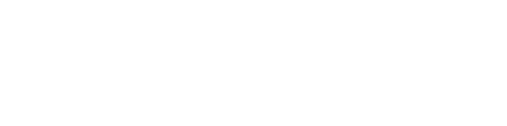

# Boseum 

    

  Università degli Studi di Padova
     
  Dipartimento di Matematica "Tullio Levi-Civita"
     
  Tecnologie Web 2023/2024

Realizzato con [@rmdevv](https://github.com/rmdevv), [@Lake020](https://github.com/Lake020) e [@Porror](https://github.com/Porror).
